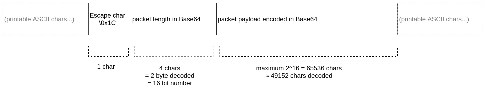

# libspt

**S**erial **P**acket **T**ransfer library


C library for transferring binary data packets over a single serial data connection side by side with log entries and
other plain text messages.

## Packet layout
A packet containing binary data sent by libspt has the following layout:



## Dependencies
* pthreads
* libevent (optional)
* termios (optional)


## Building
### Options
Set these environment variables/macros to:

`NO_LIBEVENT` - Use blocking IO instead of libevent

`NO_TERMIOS` - No `<termios.h>` will be required but the TTY utils won't be available

### Creating the static library
```bash
make
```
will create the static library at `build/libspt/libspt.a`

### Building/running the examples
_The examples are created to work with a serial tty available at /dev/ttyUSB0_

```bash
cd examples
make
cd ../build/examples
./serialexample
```
